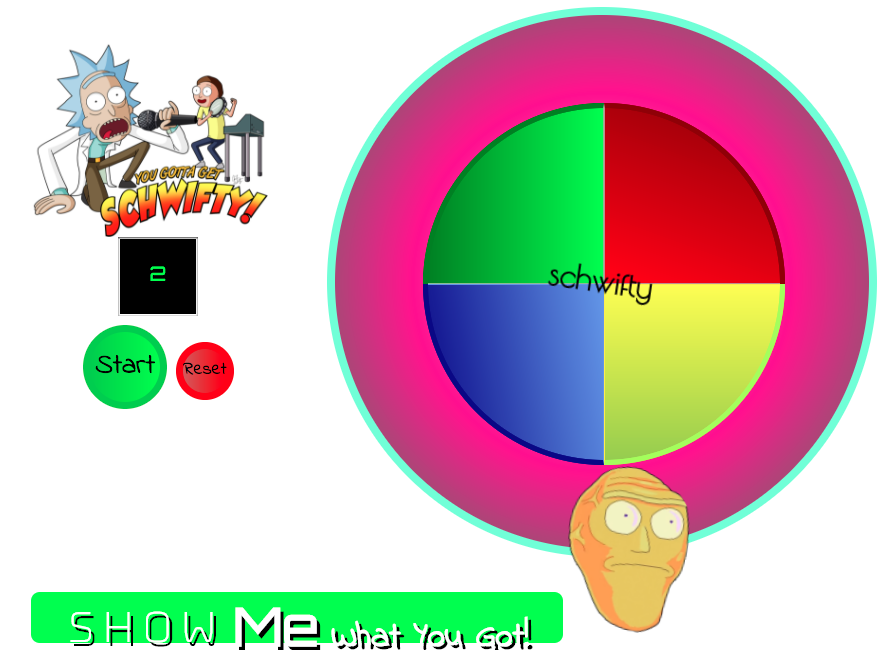

<s>Simple</s> Schwifty Simon
============================

"It's time to get schwifty!"

Introduction
------------
**Schwifty Simon** is my first major [Codeup][1] project. The object of 
the project is to build a game using html, css, and javascript/jquery. 
I used an example codepen by [Ben Blood][4] as starting reference for 
my game. My intent was to build a game that looked like simon, but with 
a humorous twist. I used Rick and Morty as inspiration for this game.  




Dependencies
------------
I originally intended to use [Bootstrap][2] for my project, however, 
it didn't allow me the functionality I was looking for. I am using 
jquery for external dependencies and [Google Fonts][3] for my font 
stylings. I have created a css and javascript file for my styling and 
functions. All of my resources are stored in the following directories: 
 
 * Audio
 * img
 * css
 * js
 
Background
----------
On page load the audio "Show me what you got" will be played along with
a text animation. All of the animation on page load is built in css; I 
wanted to separate the static animation from the responsive animation. 
I felt that this would allow for easier troubleshooting. I had linked a 
[Boodstrap][2] CDN when I first started building this project, but it 
was conflicting with my css. I decided that I wasn't going to worry 
about this site being mobile friendly as it will likely only be played 
on a desktop.
 
The css and html is pretty straight forward. I debated how I wanted to 
format the CSS, I chose to group all like elements by type (elements, 
IDs, Class, and animation). 
 
The JavaScript/Jquery code gave was a challenge. I started with creating 
all the variables I thought I would need. I only kept about half of the 
original variables. The first function I created was the hover button. 
It was originally an addclass/removeClass but it was an issue later on 
when; the opacity wasn't changing when I hovered over a button was 
played. I believe it was conflicting with the .animate jquery function. 
I decided to change all of the buttons to animate instead of 
toggleClass.
 
 **Changed from**
 ```js
//animate buttons on hover
      $('.game_buttons').hover(function() {
          $(this).toggleClass("buttonActive")
                  .stop( true, true )
  ```
 
 **Changed To**
 ```js
  //animate buttons on hover
     $('.game_buttons').hover(function() {
         $(this).animate({"opacity": ".5"}, 25);
     }, function() {
         $(this).animate({"opacity": "1"}, 25);
     });
 ```

**Referencing** someone else's [code][4] as a starting point proved to 
be more challenging than I thought. Although it me jumpstart my project,
I decided that if I wanted to learn, I would have to make this project 
<i>somewhat</i> different. I did not want to use much of the original 
code. I created my own CSS and HTML for this. I did use some of the 
javascript, primarily the start button, the code for clicking on the 
colored buttons, and the random number generator. However, this created
issues for me. The biggest challenge was determining what functions 
where necessary and which parts where not needed. 


Usage
-----
The game starts by clicking on the **Start** button. After the button 
is clicked the follows occurs:
1. The background changes 
2. The display changes to round 1
3. The function 

```jquery
//Start button
$("#startButton").click(function () {
        if (rounds >= 0) {
            score = 0;
            rounds = 1;
            userCombo = [];
            schwiftyCombo = [];
            $("#displayRounds").val(rounds);
            $("body").addClass("backgroundImage");
            gameStarted = true;
            addNewColorToSchwifty();
            userMatchesSchwifty = true;
            playSchwiftyCombo();
        }
    });
```
    
    


[1]: http://codeup.com/    "Codeup"
[2]: http://getbootstrap.com/   "Bootstrap"
[3]: http://fonts.googleapis.com/   "Google Fonts"
[4]: http://codepen.io/BenLBlood/pen/LGLEoJ  "Ben Blood Codepen"

